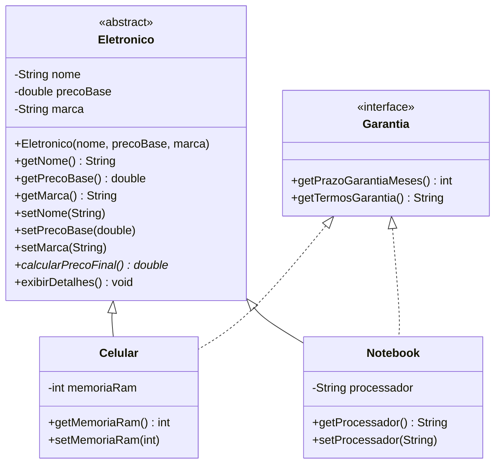

# Eletronics Shop

Aplicação de console em Java para cadastrar e listar produtos eletrônicos (celulares e notebooks) de uma loja. O projeto demonstra conceitos de Programação Orientada a Objetos: **herança**, **classe abstrata**, **interface**, **polimorfismo** e **encapsulamento**.

## Sumário

- [Funcionalidades](#funcionalidades)
- [Requisitos](#requisitos)
- [Estrutura do projeto](#estrutura-do-projeto)
- [Arquitetura e modelo de classes](#arquitetura-e-modelo-de-classes)
- [Regras de negócio](#regras-de-negócio)
- [Validação de entrada](#validação-de-entrada)
- [Como usar](#como-usar)
- [Exemplos de execução](#exemplos-de-execução)
- [Conceitos de POO aplicados](#conceitos-de-poo-aplicados)
  
## Funcionalidades

- Cadastro de **celulares** (nome, preço, marca e memória RAM).
- Cadastro de **notebooks** (nome, preço, marca e processador).
- Listagem dos produtos cadastrados, com preço base, preço final (com imposto) e informações de garantia.
- Validação das entradas do usuário: o programa repete a pergunta até receber um dado válido.

## Requisitos

- **JDK 25 ou superior.** O arquivo `Main.java` usa recursos do Java moderno (método `main` de instância, sem `public static` e sem `String[] args`, e `println` chamado diretamente). Em versões anteriores, esse código pode não compilar sem flags de preview.
- **IntelliJ IDEA** (o projeto foi desenvolvido nele, como indicam a pasta `.idea` e o arquivo `.iml`).

## Estrutura do projeto

```
EletronicShop
├── .idea
├── out
├── src
│   ├── app
│   │   └── Main.java
│   ├── model
│   │   ├── Celular.java
│   │   ├── Eletronico.java
│   │   ├── Garantia.java
│   │   └── Notebook.java
│   └── util
│       └── ValidadorEntrada.java
├── .gitignore
└── Eletronics_shop.iml
```

| Pacote  | Responsabilidade |
|---------|------------------|
| `app`   | Ponto de entrada da aplicação: menu interativo e controle do fluxo. |
| `model` | Classes de domínio: eletrônicos e contrato de garantia. |
| `util`  | Classe utilitária de validação das entradas do usuário. |

## Arquitetura e modelo de classes



### `Eletronico` (classe abstrata)

Base de todos os produtos. Guarda os atributos comuns (`nome`, `precoBase`, `marca`), com getters e setters.

- `calcularPrecoFinal()`: método **abstrato**; cada subclasse define seu próprio cálculo.
- `exibirDetalhes()`: método concreto herdado pelas subclasses.

### `Garantia` (interface)

Define o contrato de garantia dos produtos:

- `int getPrazoGarantiaMeses()`: prazo da garantia, em meses.
- `String getTermosGarantia()`: texto com os termos da garantia.

### `Celular`

Estende `Eletronico` e implementa `Garantia`.

| Item | Valor |
|------|-------|
| Atributo próprio | `memoriaRam` (`int`, em GB) |
| Preço final | preço base × **1,05** (5% de imposto) |
| Garantia | **12 meses** |

### `Notebook`

Estende `Eletronico` e implementa `Garantia`.

| Item | Valor |
|------|-------|
| Atributo próprio | `processador` (`String`) |
| Preço final | preço base × **1,10** (10% de imposto) |
| Garantia | **24 meses** |

Em ambas as classes, `getTermosGarantia()` retorna o texto: *"Garantia de X meses contra defeitos de fabrica, garantia oferecida pelo fabricante !"*, em que X é o prazo da garantia.

## Regras de negócio

| Produto   | Imposto | Preço final               | Garantia  |
|-----------|---------|---------------------------|-----------|
| Celular   | 5%      | `precoBase * 1.05`        | 12 meses  |
| Notebook  | 10%     | `precoBase * 1.10`        | 24 meses  |

Exemplo: um celular de R$ 5000,00 custa R$ 5250,00 após o imposto; um notebook de R$ 5000,00 custa R$ 5500,00.

## Validação de entrada

A classe `util.ValidadorEntrada` oferece três métodos estáticos. Todos recebem um `Scanner` e uma mensagem, e repetem a pergunta num laço até o usuário digitar um valor válido.

| Método | Retorno | Regra |
|--------|---------|-------|
| `correcaoTexto` | `String` | Remove espaços nas pontas (`trim`) e não aceita texto vazio. |
| `correcaoInt` | `int` | Aceita inteiros **maiores ou iguais a 0**. Rejeita negativos e texto não numérico. |
| `correcaoDouble` | `double` | Aceita decimais **maiores que 0**. Aceita vírgula ou ponto como separador decimal (`1500,50` e `1500.50`). Rejeita zero, negativos e texto não numérico. |

## Como usar

1. Abra o projeto no IntelliJ IDEA.
2. Verifique se o SDK do projeto é o JDK indicado em [Requisitos](#requisitos).
3. Execute o método `main` da classe `Main` (pacote `app`).

O programa exibe o menu a seguir e permanece em execução até o usuário escolher a opção `0`:

```
=== Bem vindo a Eletronics Shop ===
Digite 1 para Cadastrar Celular
Digite 2 para Cadastrar Notebook
Digite 3 para Listar produtos
Digite 0 para Sair
```

| Opção | Ação |
|-------|------|
| `1` | Cadastra um celular, pedindo nome, preço, marca e quantidade de RAM. |
| `2` | Cadastra um notebook, pedindo nome, preço, marca e modelo do processador. |
| `3` | Lista todos os produtos cadastrados. Se não houver nenhum, avisa o usuário. |
| `0` | Encerra o programa. |
| Outro número | Exibe "Opção inválida !" e mostra o menu novamente. |

## Exemplos de execução

### Cadastro de produtos

```
Informe a opção desejada: 1
Cadastrar Celular:
Insira o nome: Iphone 16
Insira o preço: 5000
Insira a marca: Apple
Insira a quantidade de ram: 8
-------------------------------
Digite 1 para Cadastrar Celular
Digite 2 para Cadastrar Notebook
Digite 3 para Listar produtos
Digite 0 para Sair
Informe a opção desejada: 2
Cadastrar Notebook:
Insira o nome: Nitro V15
Insira o preço: 5000
Insira a marca: Acer
Insira o modelo do processador: i7
```

### Listagem de produtos

```
Informe a opção desejada: 3
Listar produtos:
----------------------------------------
Nome: Iphone 16
Marca: Apple
Preço Base: R$ 5000.0
Memória RAM: 8 GB
Valor final: R$ 5250.0
Garantia de 12 meses.
Garantia de 12 meses contra defeitos de fabrica, garantia oferecida pelo fabricante !
----------------------------------------
----------------------------------------
Nome: Nitro V15
Marca: Acer
Preço Base: R$ 5000.0
Processador: i7
Valor final: R$ 5500.0
Garantia de 24 meses.
Garantia de 24 meses contra defeitos de fabrica, garantia oferecida pelo fabricante !
----------------------------------------
```

### Tratamento de entradas inválidas

```
=== Bem vindo a Eletronics Shop ===
Digite 1 para Cadastrar Celular
Digite 2 para Cadastrar Notebook
Digite 3 para Listar produtos
Digite 0 para Sair
Informe a opção desejada: 5
Opção inválida !
-----------------------------------
Digite 1 para Cadastrar Celular
Digite 2 para Cadastrar Notebook
Digite 3 para Listar produtos
Digite 0 para Sair
Informe a opção desejada:
Insira um numero !!!
------------------------------------
Informe a opção desejada: ahaj
Insira um numero !!!
```

## Conceitos de POO aplicados

- **Herança:** `Celular` e `Notebook` herdam atributos e métodos de `Eletronico`.
- **Classe abstrata:** `Eletronico` não pode ser instanciada e obriga as subclasses a implementar `calcularPrecoFinal()`.
- **Interface:** `Garantia` define um contrato que classes diferentes implementam de formas diferentes.
- **Polimorfismo:** o `estoque` é um `ArrayList<Eletronico>` que guarda celulares e notebooks. Ao listar, `calcularPrecoFinal()` executa o cálculo correto de cada tipo, e `instanceof` identifica o tipo para exibir o atributo específico (RAM ou processador).
- **Encapsulamento:** os atributos são `private` e o acesso é feito por getters e setters.
